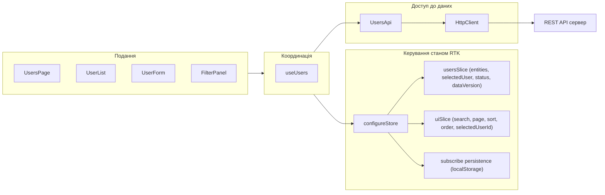

# Користувачі — Redux Toolkit (Практична робота 06)

Адміністративний модуль користувачів із централізованим керуванням станом на Redux Toolkit. Це **Завдання 3, Варіант 1** з практичної роботи 06.

Бекенд переиспользується від попередніх практичних робіт ([curs/server/](../server)) — нові серверні endpoints не потрібні.

## Стек

- React 18, TypeScript, Vite 5
- @reduxjs/toolkit 2, react-redux 9
- localStorage для відновлення параметрів інтерфейсу

## Запуск

Передумови: PostgreSQL у Docker і API-сервер уже запущені (див. [головний README](../README.md)).

```bash
cd client-redux
cp .env.example .env       # за потреби
npm install
npm run dev
```

Інтерфейс відкриється на **http://localhost:5174** (порт 5174 щоб не конфліктувати з `client/` на 5173). Vite-проксі перенаправляє `/api/*` на бекенд (`http://localhost:4000`).

## Архітектура

```
client-redux/src/
  app/
    store.ts                  # configureStore + persistence middleware
    storage.ts                # load/saveUiState (localStorage)
    App.tsx                   # AppLayout
  api/
    httpClient.ts             # fetch wrapper + ApiError
    usersApi.ts               # raw REST виклики
    departmentsApi.ts         # для select підрозділів у формі
  features/
    users/
      usersSlice.ts           # entities, selectedUser, status, error, dataVersion
      usersThunks.ts          # 5 createAsyncThunk для REST
      usersSelectors.ts       # createSelector мемоїзовані
    ui/
      uiSlice.ts              # search, page, pageSize, sort, order, selectedUserId
      uiSelectors.ts
  hooks/
    useAppDispatch.ts         # typed useDispatch
    useAppSelector.ts         # typed useSelector
    useDebouncedValue.ts
    useToast.tsx              # toast notifications context
    useUsers.ts               # фасад: state + bound actions
  components/                 # презентаційні UI без знання про store
    Button, FormField, Modal, ConfirmDialog, Toaster, ErrorMessage,
    StatusCard, Pagination
  pages/users/
    UsersPage.tsx             # composition root + центральний useEffect
    FilterPanel.tsx
    UserList.tsx
    UserCard.tsx
    UserForm.tsx              # створення/редагування за selectedUser
  types/
    api.ts, user.ts
  index.css, main.tsx
```

### Потік даних



## Slices

### `usersSlice`

```ts
interface UsersState {
  entities: User[];
  meta: PaginationMeta | null;
  selectedUser: User | null;
  status: "idle" | "loading" | "success" | "error";    // для GET-запитів
  mutationStatus: RequestStatus;                         // для CRUD-операцій
  error: string | null;
  dataVersion: number;                                   // інкремент = invalidation
}
```

Reducers: `invalidateUsers`, `clearSelectedUser`, `setSelectedUser`, `clearError`.

`extraReducers` обробляє pending/fulfilled/rejected для всіх 5 thunks.

### `uiSlice`

```ts
interface UiState {
  search: string;
  page: number;
  pageSize: number;
  sort: "fullName" | "email" | "position" | "createdAt";
  order: "asc" | "desc";
  selectedUserId: number | null;
}
```

Reducers: `setSearch` (скидає `page=1`), `setPage`, `setSort` (скидає `page=1`), `setOrder`, `toggleSort`, `setSelectedUserId`, `resetFilters`.

## Async thunks (`features/users/usersThunks.ts`)

| Thunk | Призначення |
| --- | --- |
| `fetchUsers(query)` | Список з пошуком, сортуванням, пагінацією |
| `fetchUserById(id)` | Гідратація `selectedUser` після `F5` |
| `createUser(dto)` | Створення; після fulfilled → `dataVersion += 1` |
| `updateUser({id, dto})` | Редагування; після fulfilled → `dataVersion += 1` |
| `deleteUser(id)` | Видалення; після fulfilled → `dataVersion += 1` |

Кожен thunk використовує `rejectWithValue` для нормалізованих повідомлень про помилки.

## Персистентність (localStorage)

`[src/app/storage.ts](src/app/storage.ts)` зберігає до ключа `curs-redux-ui-v1` whitelist полів `uiSlice`:
**search, page, sort, order, selectedUserId**.

`[src/app/store.ts](src/app/store.ts)`:
1. Під час створення store використовує `preloadedState: { ui: loadUiState() }`.
2. `store.subscribe` зі debounce 200мс зберігає поточний `state.ui` після кожної зміни.

Після оновлення сторінки (`F5`):
- Пошуковий рядок, поточна сторінка, сортування і вибір користувача відновлюються автоматично.
- Якщо `selectedUserId !== null`, у `UsersPage` диспатчиться `fetchUserById` для гідратації форми редагування.

## Інвалідація після CRUD

У `usersSlice` після кожного успішного CRUD-thunk інкрементується лічильник `dataVersion`. У `UsersPage` цей лічильник входить у залежності центрального `useEffect`, тому список автоматично перезавантажується з сервера. Жодного ручного refresh не потрібно.

## Loading / Success / Error

- `StatusCard` (праворуч у заголовку) показує великий бейдж зі статусом запиту і опис.
- `status-badge` на заголовку списку показує те саме компактно.
- `ErrorMessage` баннер виводить текст помилки з API.
- Кнопки форми/видалення блокуються (`mutating` від `selectMutationStatus`) під час CRUD-операцій.
- Toaster показує success/error повідомлення після кожної дії.

## Як це відповідає рубрикатору

| Вимога | Файл / коментар |
| --- | --- |
| `configureStore` | [src/app/store.ts](src/app/store.ts) |
| ≥2 slice | `usersSlice` + `uiSlice` |
| Async thunks для REST | [src/features/users/usersThunks.ts](src/features/users/usersThunks.ts) (5 thunks) |
| Окремий API-модуль | [src/api/](src/api) — `httpClient.ts`, `usersApi.ts`, `departmentsApi.ts` |
| `useSelector` + `useDispatch` | типізовані `useAppSelector` / `useAppDispatch` |
| Централізоване зберігання UI-параметрів | `uiSlice` — search, page, sort, order, selectedUserId |
| Відновлення з localStorage | [src/app/storage.ts](src/app/storage.ts) + `preloadedState` + `store.subscribe` |
| Інвалідація після CRUD | `dataVersion` counter → центральний `useEffect` у `UsersPage` |
| Loading / success / error | `usersSlice.status`, `mutationStatus`, `StatusCard`, `ErrorMessage`, disabled-кнопки |

## Перевірка персистентності (швидкий чек)

1. Введіть текст у пошук → бейдж миготить `LOADING` → `SUCCESS`.
2. Перейдіть на сторінку 2 пагінації, змініть сортування, натисніть «Редагувати» на якомусь користувачі.
3. **Натисніть F5.**
4. Інтерфейс відновлюється у тому ж стані: пошук, сторінка, сортування, активний користувач у формі редагування.

## Скрипти

| Скрипт | Дія |
| --- | --- |
| `npm run dev` | Vite dev-сервер на `http://localhost:5174` |
| `npm run build` | Продакшн-збірка (TS + Vite) |
| `npm run preview` | Перегляд продакшн-збірки |
| `npm run typecheck` | Перевірка типів без збірки |
